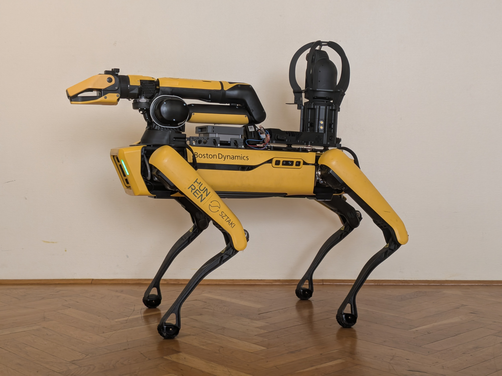

<table align="center"><tr><td align="center" width="9999">

  # SPOT PTZ Exploration
  

   <!-- Stolen without remorse -->
  

       
    
    
    
    </a>
  

    
    
    
    
  

  Active visual search with a PTZ camera for Boston Dynamics Spot.
</td></tr></table>

## Overview
This repository contains the code, simulation, and documentation for a master's thesis project that develops an active visual search system for a Pan–Tilt–Zoom (PTZ) camera mounted on the Boston Dynamics Spot robot. It is based on the `SPOT_dev` repository used by the MPLab group and reuses its layout as a starting point for development. 
The work implements a modular ROS 2 software stack and provides PTZ control, perception, Gazebo-based simulation, and exploration behaviors. Key contributions include a perception and optimization pipeline that uses 2D object detections (YOLO), projects detections into 3D via OctoMap ray-casting, and tracks landmarks in an iSAM2 factor graph, together with an extensible architecture that runs on both the Gazebo simulator and the real Spot platform via Nav2 integration.

## Packages
'ptz_exploration_core' - Core package providing perception, exploration, landmark management and the factor-graph optimization pipeline.

'ptz_exploration_sim' - Simulation package with Gazebo worlds, robot models and launch files used to validate algorithms in a simulated environment and reproduce experiments.

'ptz_exploration_spot' - Spot-specific integration package that contains drivers/launchers and configuration to run the system on the Boston Dynamics Spot platform.

## Build and Start Container

1) `cd ./SPOT_dev/misc/docker` - Change into the Docker helper directory.
2) `./build_docker.sh` - Build the project image. (If building for the Orin, rename `Dockerfile.orin` to `Dockerfile` before building).
3) `./run_docker.sh` - Start the container.
4) `docker exec -it spot-ptz-exploration bash` - Open an interactive shell inside the running container.

## Run
Inside the container, launch the commands below to run the system in simulation or on the Spot robot.

### Simulation

1) `ros2 launch ptz_exploration_sim world.launch.py` - Starts the Gazebo world and experimental environment.
2) `ros2 launch ptz_exploration_sim robot.launch.py` - Spawns the robot model and brings up robot-specific simulation nodes.
3) `ros2 launch ptz_exploration_core launch.py` - Launches the core perception, PTZ controller, exploration behaviors and the factor-graph backend configured for the simulator.

### Spotty

1) `ros2 launch ptz_exploration_spot launch.py` - Starts Spot-specific drivers/bridge and hardware interfaces as well as RVIZ to visualize the system.
2) `ros2 launch ptz_exploration_core launch.py config_file:=config_spot.yaml` - Launches the core stack configured for the Spot robot.

## Config Files
Each ROS 2 package includes a `config/` folder with runtime and node configuration files. Below is a concise inventory of the files in each package:

- `ptz_exploration_core/config`:

  - `config_sim.yaml` — Simulation-specific exploration parameters (node options, topic names and feature toggles).
  - `config_spot.yaml` — Spot-specific exploration runtime parameters and topic mappings for hardware deployment.

  - `nav2_behavior_tree.xml` — Behavior tree defining Nav2 navigation behaviors used during exploration.
  - `nav2_params_sim.yaml` — Nav2 parameter tuned for the simulator (planner, controller and costmap settings).
  - `nav2_params_spot.yaml` — Nav2 parameter tuned for the Spot robot and its hardware characteristics.
  
  - `plots.yaml` — Plotting and logging configuration for experiment figure generation and runtime traces.

- `ptz_exploration_sim/config`:

  - `config.yaml` — Simulation runtime settings (world-specific options and simulation-time parameters).
  - `sim.rviz` — RViz layout and display settings tailored for the simulated robot and sensors.

- `ptz_exploration_spot/config`:

  - `config.yaml` — Hardware/runtime parameters and topic mappings for running on Spot.
  - `spot.rviz` — RViz configuration tailored for the Spot robot topics and visualization needs.